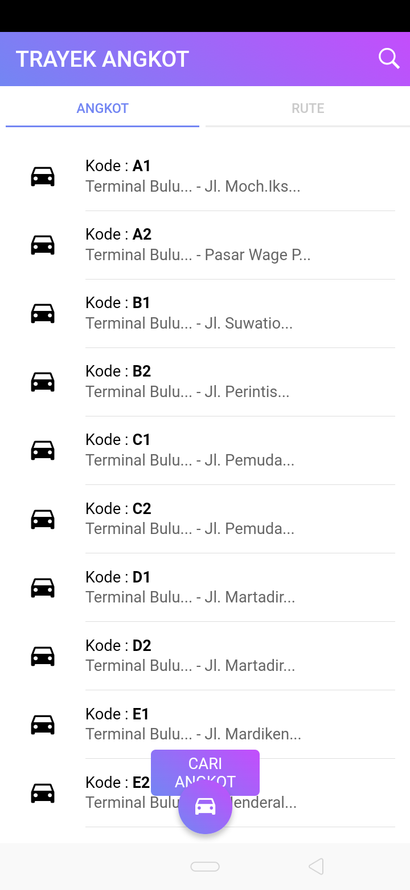
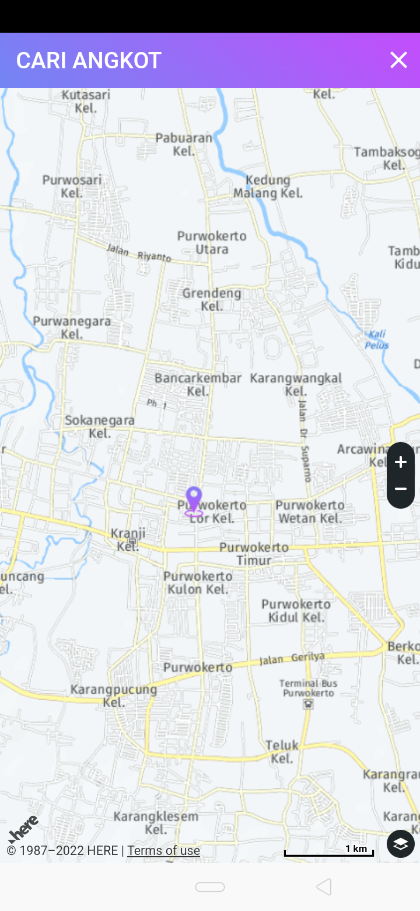
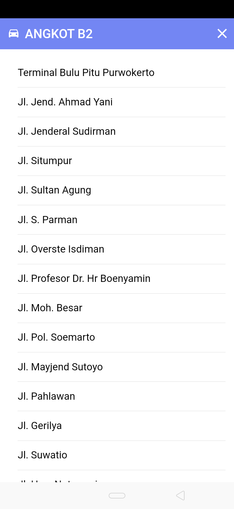
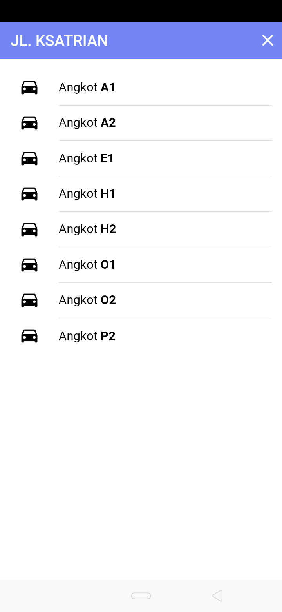
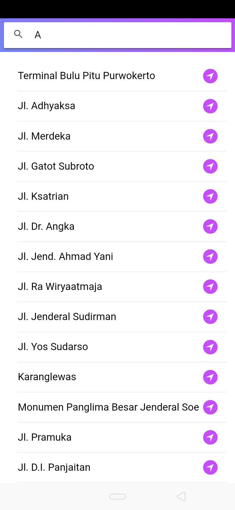

# Trayek Angkot

Buka aplikasi, klik cari angkot, klik pada pada jalan maps untuk menentukan lokasi yang dituju, jika terdapat Angkot maka akan muncul daftar angkot pada aplikasi, pilih angkot dan aplikasi akan mencarikan rute terdekat untuk jalur angkot tersebut.

## Preview

<table>
  <tr>
    <td>
      
    </td>
    <td>
      
    </td>
  </tr>
  <tr>
    <td>
      
    </td>
    <td>
      
    </td>
  </tr>
  <tr>
    <td>
      
    </td>
    <td>
      
    </td>
  </tr>
  <tr>
    <td>
      
    </td>
    <td>
      
    </td>
  </tr>
</table>
